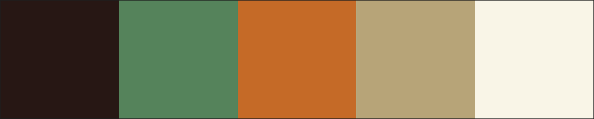
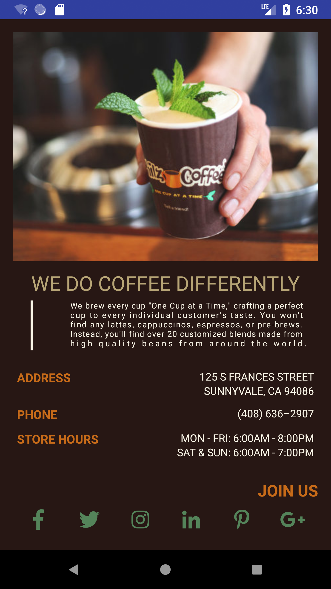

<h1> Philz App </h1>

<h4> Designed and implemented a single screen app that displays information about Philz </h4>

Since I love Philz so much, it was not hard to choose Philz as a business I want to design this single screen app for.
To maintain a consistent theme, I utilized only Philz colors for the app (please see color palatte below for reference).

HEX codes for color theme:

<ul>#271714</ul>
<ul>#54845A</ul>
<ul>#C76B19</ul>
<ul>#B7A576</ul>
<ul>#F9F5E6</ul>

### Contributing

I would love for you to help make the skeleton more awesome. There are three ways to contribute:

1. Ask for a bug fix or enhancement!
2. Submit a pull request for a bug fix or enhancement!
3. Code review an open pull request!

Be prepared to give and receive specific, actionable, and kind feedback!
